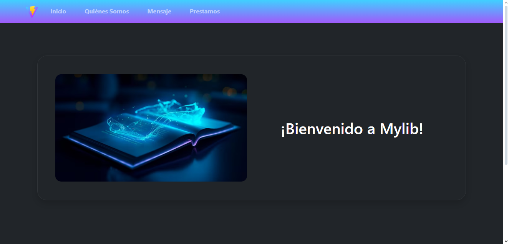

# MyLib
MyLib es una pagina hecha por Hammer Cano que brinda un servicio de préstamos de libros donde se coloca en práctica lo aprendido en las clases sobre React para la nota del 10% del tercer corte, tiene tres funciones principales: mostrar información sobre los usuarios extraídos de https://jsonplaceholder.typicode.com/users, realizar un mensaje personalizado, y un formulario donde se registran préstamos de libros.

